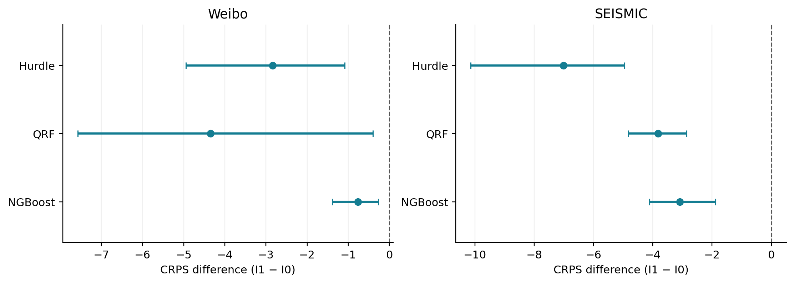
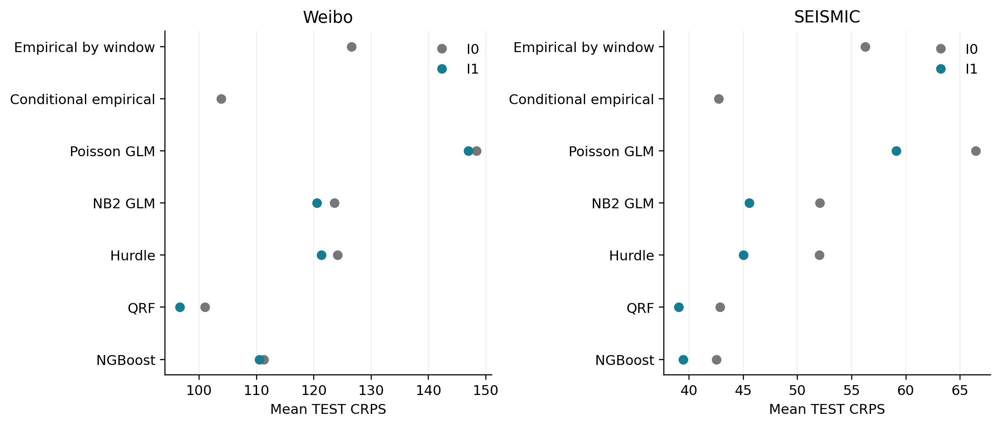
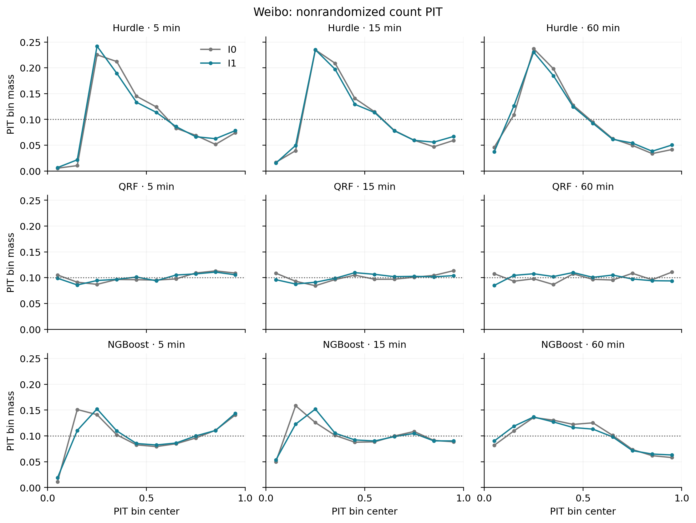
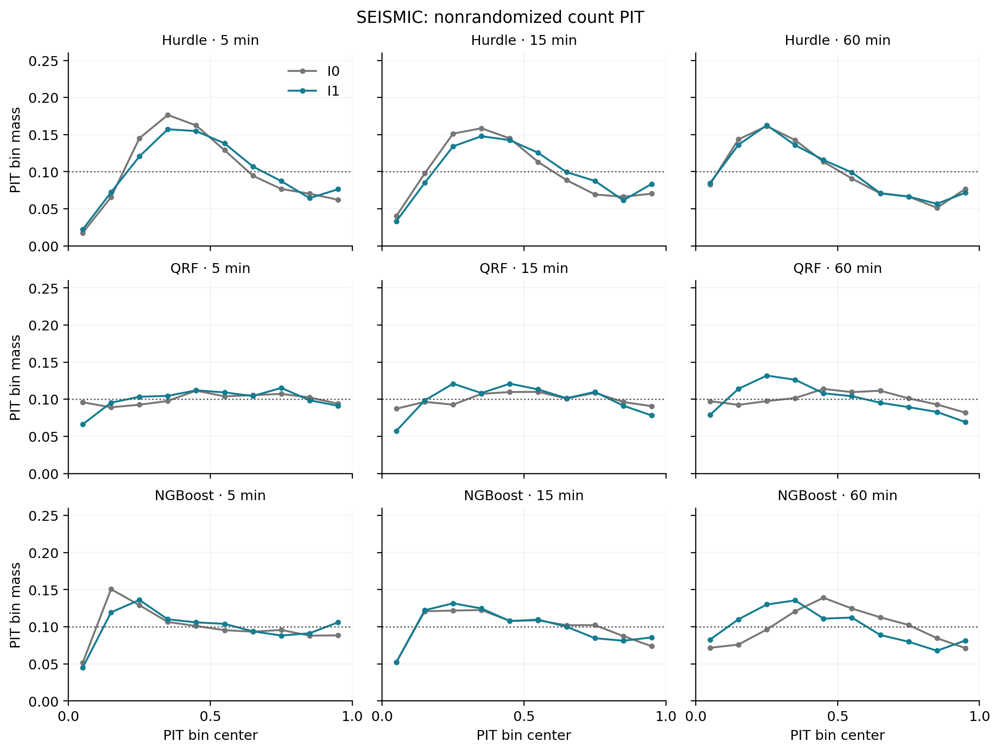

# Prefix Size and Timing in Probabilistic Forecasts of Recorded Cascade Growth

*Reviewed manuscript — 13 September 2026. Includes the unchanged Phase 13F primary results and the completed Phase 14 supplementary analyses. Prepared for scientific and author review; author declarations, public artifact arrangements and journal formatting remain to be completed.*

## Abstract

Forecasting cascade growth requires knowing what event timing adds once early volume is available. We compare predictive count distributions from prefix-size inputs and seven additional timing summaries within Hurdle regression, quantile regression forests (QRF), and NGBoost. Weibo and SEISMIC each contribute 6,000 training, 2,000 validation and 5,000 test roots. Prefixes of 5, 15 and 60 minutes predict additional recorded events before a common endpoint 24 hours after the root. Within each family, information sets share validation-selected settings and seed schedules. Conditioning an empirical reference on prefix size reduces mean discrete continuous ranked probability score (CRPS) from 126.569 to 103.816 on Weibo and from 56.224 to 42.740 on SEISMIC. Timing yields further within-family reductions of 0.69–4.31% and 7.25–13.48%, respectively; all six conditional Bonferroni-adjusted intervals exclude zero. QRF with timing has the lowest descriptive CRPS, improving on the conditional empirical reference by 6.91% and 8.61%. A separately specified post-test supplement finds lower CRPS for timing than for seven independent noise coordinates in all six source–family comparisons, with adjusted intervals below zero. Prefix-size stratification reveals heterogeneous effects, including differences at empty prefixes where timing inputs are constant. Distribution-score gains coexist with calibration departures. The study quantifies the incremental value of compact timing representations relative to strong size-based procedures, while identifying why aggregate improvements should not be interpreted as a universal prefix-density rule.

**Keywords:** cascade prediction; probabilistic forecasting; count distributions; temporal features; calibration; empirical evaluation.

## 1. Introduction

Early activity is a strong predictor of online popularity. An informative benchmark must therefore ask what a richer representation contributes beyond a competitive forecast based on current size. Early-volume models and subsequent work on temporal patterns establish this question's precedents. [Szabo and Huberman (2010)](https://arxiv.org/abs/0811.0405), [Pinto et al. (2013)](https://doi.org/10.1145/2433396.2433443), [Cheng et al. (2014)](https://arxiv.org/abs/1403.4608).

A count distribution describes the probability of no further recorded activity, typical growth and large outcomes in one forecast. Proper scores evaluate this distribution; count-calibration diagnostics show where its probabilities remain unreliable. Examining both can reveal improvements that a point-error ranking alone does not describe. [Gneiting and Raftery (2007)](https://sites.stat.washington.edu/raftery/Research/PDF/Gneiting2007jasa.pdf), [Czado et al. (2009)](https://onlinelibrary.wiley.com/doi/10.1111/j.1541-0420.2009.01191.x).

We ask: **How much do compact timing summaries add to size-based probabilistic forecasts, and how does the observed benefit vary with the available prefix activity?** We study the Weibo release associated with DeepHawkes and the SEISMIC Twitter archive, fitting each source separately. The primary comparison adds a fixed seven-feature set to prefix size and observation duration within three established model families. Settings and seed schedules are shared across the two information sets and locked before testing. Conditional empirical, ordinary negative-binomial and Poisson forecasts make the size-based reference explicit.

Our contribution is an empirical assessment of this restricted forecasting problem. Six planned test contrasts establish the direction and magnitude of the procedure-level timing benefit. Comparisons with conditional empirical forecasts put those gains in context. Separately specified supplementary analyses examine prefix-size strata and a dimension-matched independent-noise control. Together they distinguish average gains, heterogeneous subgroup behavior and the performance of uninformative added coordinates. Count-calibration and duplicate sensitivity complete the interpretation. We evaluate the compact summaries within general-purpose distributional learners; comparing full event-history processes and specialized cascade architectures is a separate scope.

Predictability research motivates careful interpretation of residual error. Martin et al. distinguish limits associated with data and models from intrinsic uncertainty, while Hofman et al. connect prediction, explanation and evaluation in social systems. Our finite set of fitted procedures estimates neither a Bayes-optimal forecast nor an intrinsic ceiling. The observable quantity here is improvement under stated information and estimation choices. [Martin et al. (2016)](https://arxiv.org/abs/1602.01013), [Hofman et al. (2017)](https://www.microsoft.com/en-us/research/publication/prediction-explanation-social-systems/).

## 2. Related work and the comparison being made

### 2.1 Early popularity, event histories and finite horizons

Early-volume prediction has a long history. Pinto et al. use patterns of early YouTube views to improve popularity forecasts; the shape of initial activity is therefore an established precedent, not a new discovery of this study. Their point-prediction task differs from our count-distribution contrast. [Pinto et al. (2013)](https://doi.org/10.1145/2433396.2433443). Szabo and Huberman relate early and later popularity, while Cheng et al. investigate predictability as cascade observations accumulate. Mishra et al. directly compare feature-driven and point-process approaches and find competitive performance from basic user features and event-time summaries, with further gains from process-derived information. Their study is a close precedent for our motivation; our experiment concentrates on within-family information changes and integer-count distributions. [Szabo and Huberman (2010)](https://arxiv.org/abs/0811.0405), [Cheng et al. (2014)](https://arxiv.org/abs/1403.4608), [Mishra et al. (2016)](https://arxiv.org/abs/1608.04862).

Self-exciting approaches represent diffusion through event histories. SEISMIC estimates evolving infectiousness for final-popularity prediction; TiDeH models time-dependent retweet dynamics; MaSEPTiDE develops marked, time-dependent excitation. Finite-horizon prediction is also established: CASPER derives conditional future-count moments, and Haimovich et al. develop arbitrary-horizon popularity prediction on Facebook page content. The prediction horizon, available marks and forecast output must be aligned before their numerical results can be compared with ours. [Zhao et al. (2015)](https://snap.stanford.edu/seismic/), [Kobayashi and Lambiotte (2016)](https://arxiv.org/abs/1603.09449), [Chen and Tan (2018)](https://arxiv.org/abs/1802.09304), [Zhang et al. (2022)](https://proceedings.mlr.press/v162/zhang22a.html), [Haimovich et al. (2022)](https://arxiv.org/abs/2009.02092).

### 2.2 Learned cascade representations and evaluation protocols

The survey by [Zhou et al. (2021)](https://arxiv.org/abs/2005.11041) organizes cascade analysis around diffusion models, feature-based prediction and deep learning. DeepHawkes, CasFlow, continuous-time graph learning and CasFT represent increasingly rich temporal or structural information. CasFlow explicitly models uncertainty in latent cascade representations; CasFT generates future trends through a diffusion model. These approaches establish substantial prior work on temporal and uncertainty-aware cascade modeling. Our experiment evaluates the predictive count CDF from a restricted input set. Comparisons with published log-scale point errors would require matching the cohort, preprocessing, information access and predictive output. [Cao et al. (2017)](https://github.com/CaoQi92/DeepHawkes), [Xu et al. (2023)](https://www.xoveexu.com/file/paper/21-11-TKDE-CasFlow.pdf), [Lu et al. (2023)](https://arxiv.org/abs/2306.03756), [Jing et al. (2024 preprint)](https://arxiv.org/abs/2409.16619).

Evaluation design is itself an active subject. The recent CascadeBench preprint examines temporal and user-overlap protocols and their effects on conclusions. Our Weibo experiment provides root-user-disjoint retrospective evaluation; its single publication day cannot supply a chronological forecasting test. SEISMIC permits chronological blocks with label maturity. These different designs are part of the interpretation of the results. [Peng et al. (2026 preprint, version 3)](https://arxiv.org/html/2510.25348v3).

### 2.3 Distributional learning and count assessment

QRF estimates a conditional distribution through forest leaf memberships, and NGBoost learns distribution parameters through natural-gradient boosting. Poisson, negative-binomial and two-part count models supply established parametric alternatives. Proper scores and count-appropriate PIT diagnostics provide the evaluation framework. We use these methods for a controlled comparison of available prefix representations. [Meinshausen (2006)](https://www.jmlr.org/papers/v7/meinshausen06a.html), [Duan et al. (2020)](https://proceedings.mlr.press/v119/duan20a.html), [Zeileis et al. (2008)](https://www.jstatsoft.org/article/view/v027i08), [Czado et al. (2009)](https://onlinelibrary.wiley.com/doi/10.1111/j.1541-0420.2009.01191.x), [Jordan et al. (2019)](https://www.jstatsoft.org/article/view/v090i12).

Table 1 summarizes the relevant distinctions. It positions the empirical question relative to its closest precedents.

**Table 1. Closest methodological and domain precedents.**

| Prior work | Relevant precedent | Question addressed here |
| --- | --- | --- |
| Pinto et al.; Cheng et al.; Mishra et al. | Predictive timing features and feature/process comparisons | Magnitude of a fixed timing-feature addition under count CRPS within each family |
| SEISMIC; TiDeH; MaSEPTiDE | Event-history models of growth | Compact timing summaries with no marks or specialized process-model superiority claim |
| CASPER; Haimovich et al. | Conditional future moments and finite-horizon popularity | A fully specified integer-count distribution at a root-relative endpoint |
| DeepHawkes; CasFlow; CTCP; CasFT | Temporal/structural representation learning | Interpretable restricted-input comparisons, evaluated using proper distribution scores |
| CascadeBench | Protocol-sensitive cascade benchmarking | Source-specific distributional information contrasts with explicit split limitations |
| QRF; NGBoost; count-regression literature | Established distribution families | Empirical behavior when the available prefix information changes |
| Martin et al.; Hofman et al. | Predictive accuracy and its limitations in social systems | Procedure-level gains, with no claim to identify intrinsic predictability |
| Count-assessment and proper-score literature | Calibration and distribution evaluation | Joint interpretation of CRPS, no-growth probabilities and interval behavior |

## 3. Data, forecast target and information sets

### 3.1 Recorded activity at a fixed endpoint

For cascade root \(i\), let \(t_{ij}\) denote the root-relative integer timestamp of a nonroot record. For \(w\in\{300,900,3600\}\) seconds, the observed prefix and response are

\[
\mathcal H_i(w)=\{t_{ij}:0\le t_{ij}<w\},\qquad
Y_{i,w}=\sum_j\mathbf1\{w\le t_{ij}<86400\}.
\]

Thus all three predictions end 24 hours after the root; the remaining forecast duration shortens as the prefix grows. We remove exactly the designated root record and preserve other zero-time records, ties and repeated records. The target is the count recorded in the release. Dataset selection and incomplete knowledge of collection coverage limit its interpretation as complete real-world diffusion.

### 3.2 Source-specific cohorts

Each source contributes 13,000 roots: 6,000 for training, 2,000 for validation and 5,000 for testing. Roots remain intact across their three windows. Cohort selection uses identities, origin metadata, prior-use exclusions and declared quality status; observed response sizes and model scores do not rank candidate roots. The combined study has 26,000 roots and 78,000 distinct root-window cases, including 30,000 test cases.

The DeepHawkes Weibo release contains 119,313 messages from 1 June 2016. Nine source roots are excluded for invalid timestamps or missing root-user identity. Root users are assigned to disjoint role pools by a fixed hash, and roots are selected within the pools by a second fixed ordering. There are 3,467 root-user groups among the 5,000 test roots. This design assesses held-out root users within the archived release; other shared participants and topics can still connect roots. [DeepHawkes data documentation](https://github.com/CaoQi92/DeepHawkes).

The SEISMIC release is selected from Twitter activity in October–November 2011, retaining English-author root tweets without hashtags that reached at least 50 retweets. We exclude the 18,000 roots used in legacy BRACE studies and all entries associated with four duplicated root identities. Training roots have origin day below 4; validation roots lie in \([5.05,7)\); test roots have origin day at least 8.05. Latest earlier-role response endpoints precede earliest later-role root origins. This establishes label maturity in the archive, while the release's future-popularity selection still prevents interpretation as an unselected live deployment sample. [SEISMIC release documentation](https://snap.stanford.edu/seismic/).

Table 2 describes the test responses. These descriptive summaries were assembled after evaluation; they did not guide model selection. Raw CRPS is analyzed separately by source because the count scales and selection mechanisms differ.

**Table 2. Test-sample profile, 5,000 roots per source at each prefix.**

| Source | Prefix (min) | Median prefix count | Empty prefixes | Mean response | Median response | Maximum response | Zero responses |
| --- | --- | --- | --- | --- | --- | --- | --- |
| Weibo | 5 | 1 | 1,622 | 172.677 | 30 | 65,706 | 19 |
| Weibo | 15 | 4 | 764 | 159.864 | 26 | 63,241 | 66 |
| Weibo | 60 | 11 | 334 | 125.241 | 18 | 57,352 | 166 |
| SEISMIC | 5 | 30 | 103 | 129.260 | 69 | 9,739 | 12 |
| SEISMIC | 15 | 46 | 53 | 103.425 | 54 | 8,843 | 31 |
| SEISMIC | 60 | 64 | 26 | 70.783 | 33 | 7,478 | 78 |

### 3.3 Information contrast

The baseline information set \(I_0\) contains \(\log(1+n_{i,w})\) and \(\log w\), where \(n_{i,w}=|\mathcal H_i(w)|\). The augmented set \(I_1\) adds seven timing summaries computed exclusively from the prefix:

| Added feature | Definition | Empty/degenerate value |
| --- | --- | --- |
| First-event fraction | First nonroot timestamp divided by \(w\) | 1 for an empty prefix |
| Recency fraction | \((w-\text{last timestamp})/w\) | 1 for an empty prefix |
| Median-gap fraction | Median consecutive nonroot gap divided by \(w\) | 0 with fewer than two records |
| Gap coefficient of variation | Population gap standard deviation divided by mean gap | 0 with no positive mean gap |
| Zero-gap fraction | Proportion of consecutive gaps equal to zero | 0 with fewer than two records |
| Last-quarter fraction | Fraction of prefix records at times at least \(0.75w\) | 0 for an empty prefix |
| Last-tenth fraction | Fraction at times at least \(0.9w\) | 0 for an empty prefix |

The prefix count remains available to interpret the sentinel values. Input matrices exclude identifiers, root-user identity, absolute origin time, followers, text, global graphs and future records. Linear-model scaling is fitted on training rows only. All three windows are pooled for fitting, with window duration supplied as a feature. The comparison measures the benefit of this seven-feature set under the specified estimators; it does not identify the separate contribution of each feature.

## 4. Forecasting procedures and model selection

### 4.1 Count distributions

The primary families are Hurdle, QRF and NGBoost. Hurdle uses a logistic model for \(\pi(x)=P(Y>0\mid x)\) and a positive law \(Y\mid Y>0=1+K\), with \(K\) following NB2 regression. In the NB2 parameterization, \(\operatorname{Var}(K\mid x)=\mu(x)+\mu(x)^2/r\). The positive component is a shifted negative binomial. Ordinary NB2 and Poisson regressions, with log-link means, provide additional references.

QRF uses 128 bootstrap-grown regression trees. All original training rows are routed through each tree; a query receives uniform weight within its matching leaf, averaged over trees. The resulting distribution has finite support on training responses. This specifies our leaf-weight convention and its inability to place mass above the largest training response. [Meinshausen (2006)](https://www.jmlr.org/papers/v7/meinshausen06a.html).

NGBoost fits a Normal distribution to \(\log(1+Y)\), using Normal LogScore and natural gradients. We define the predicted integer count by

\[
C=\max\{0,\lfloor \exp(Z)-0.5\rfloor\},\quad Z\sim N(\mu,\sigma^2),\qquad
F_C(k)=\Phi\!\left(\frac{\log(k+1.5)-\mu}{\sigma}\right),\ k\ge0.
\]

Training optimizes the transformed continuous density, while evaluation uses this rounded count law. The adapter is explicitly part of the tested procedure. [Duan et al. (2020)](https://proceedings.mlr.press/v119/duan20a.html).

Two empirical references use training responses at the corresponding window. The unconditional reference assigns equal mass to all such responses. The conditional reference assigns equal mass to the \(k\) nearest training roots in log-prefix count, using a fixed lexical identity tie-break. Both references use \(I_0\). They help distinguish the contribution of conditioning on size from the contribution of adding timing.

### 4.2 Shared-setting selection and retained models

Each learned family has four predefined candidates. Hurdle, NB2 and Poisson vary their count-regression penalty; QRF varies depth and minimum leaf size; NGBoost varies depth and boosting budget. Within each source and family, a single candidate is selected by validation CRPS averaged over both information sets and all prescribed seeds. A candidate must complete the required fits and every validation score for both information sets. This rule chooses good joint predictive performance rather than maximizing the observed timing improvement.

QRF and NGBoost use three fixed seeds; deterministic procedures use one. The selected training-fitted objects are retained without a training-plus-validation refit. Sharing a candidate and seed schedule controls those choices, while adding predictors still changes model dimension and effective flexibility. Selection/evaluation separation addresses the risk of favorable selection-set estimates. [Cawley and Talbot (2010)](https://www.jmlr.org/papers/v11/cawley10a.html).

Numerical completeness is part of candidate eligibility. All retained procedures completed the test evaluation; no failed test root or seed was deleted. The supplement records candidate exclusions, selected settings, numerical rules and the complete experimental accounting.

## 5. Evaluation and statistical analysis

### 5.1 Scores and calibration

The primary score is discrete CRPS, also expressible as a ranked probability score on integer support:

\[
\operatorname{CRPS}(F,y)=\sum_{k=0}^{\infty}\left[F(k)-\mathbf1\{y\le k\}\right]^2.
\]

Secondary diagnostics are Brier loss for \(Y=0\), absolute error of the predictive median, central 90% interval score and width, and coverage at 50%, 80%, 90% and 95%. Count calibration uses randomized PIT and nonrandomized PIT-bin mass, with ten fixed bins, alongside no-growth reliability bins. The randomized value lies between \(F(y-1)\) and \(F(y)\), using a reproducible uniform shared across procedures for each case. The nonrandomized construction allocates probability mass across the same interval; boundary cases are specified in the implementation. These diagnostics follow established count-forecast assessment principles. [Czado et al. (2009)](https://onlinelibrary.wiley.com/doi/10.1111/j.1541-0420.2009.01191.x).

Central discrete intervals may be conservative, and marginal coverage alone does not establish calibration conditional on predictors. We interpret coverage with interval width, interval score and PIT. The numerical score contract and retained failures are documented in Supplement S3. No test-driven recalibration is performed.

### 5.2 Estimands and paired uncertainty

For a root, we average loss over its three windows and then over the prescribed model seeds. Let \(\bar L^{(a)}_{i,f}\) denote that average for information set \(a\) and family \(f\). The primary contrast is

\[
\Delta_{s,f}=\frac{1}{N_s}\sum_{i\in s}\left(\bar L^{(1)}_{i,f}-\bar L^{(0)}_{i,f}\right),
\]

for three families and two sources. Negative values favor timing. The stochastic-procedure target averages losses of separately fitted seeded models; it does not score an ensemble mixture. Relative reduction, \(1-\bar L^{(1)}/\bar L^{(0)}\), is a point summary. No operational practical-significance cutoff is imposed; Supplement S8 preserves the earlier protocol convention.

Ten thousand paired bootstrap vectors are drawn per source and reused across its three contrasts. Weibo resamples root-user groups uniformly, then divides sampled loss sums by sampled root counts to preserve root weighting. SEISMIC resamples roots. All windows and seeds remain within their root. Percentile bounds at \(0.05/12\) and \(1-0.05/12\) give approximate 99.1667% intervals for each contrast, using Bonferroni adjustment over six comparisons at family level 0.05.

These intervals condition on the retained fitted models, selected samples and resampling assumptions. They exclude uncertainty from retraining, source selection and unresolved dependence beyond the recorded grouping. Per-window metrics, between-family rankings, calibration and duplicate sensitivity are descriptive. The planned sensitivity removes duplicate-token-flagged Weibo test roots from the descriptive contrasts only, preserving the primary sample and fitted models.

### 5.3 Supplementary interpretation after primary testing

Expert feedback after Phase 13F motivated a separate analysis specification. Within each source and each prefix window, saved losses are stratified by 0, 1–2, 3–9, 10–49 and at least 50 recorded nonroot events. All three families and both empirical references are retained. Windows are not pooled to infer a density pattern. For the 90 timing contrasts, 2,000 common resamples per source preserve the primary sampling units and root weighting. Pointwise 95% intervals are reported only with at least 30 observed sampling units and sufficient valid resamples. These are exploratory subgroup intervals, separate from the six primary comparisons. Fixed bins and complete tables limit selective presentation; they do not remove the post-test origin of the analysis.

The complementary negative control adds seven independent Uniform(−√3, √3) coordinates to I0. Three fixed noise realizations are crossed with the original model seeds, sharing each realization across families and generating separate training and test streams. New control models use the previously selected settings without validation reselection. Original I0/I1 forecasts remain fixed. We average losses over windows, fitting seeds and noise realizations, then compare noise−I0 and I1−noise. A separate family of 12 supplementary contrasts uses 10,000 paired bootstrap vectors per source with the original grouping and root weighting, and percentile bounds at 0.05/24 and 1−0.05/24. These approximate 99.5833% individual intervals condition on the fitted models and three fixed realizations; they do not quantify variability over arbitrary new training samples or noise draws.

This control matches input dimension. It assesses uninformative augmentation under the specified fitting procedure, while leaving differences in predictor dependence, split opportunities and effective flexibility. Noise can itself improve a forest's accuracy, and unrestricted timing-feature permutation can force extrapolation. These precedents motivate retaining every control outcome and avoiding a pure-capacity interpretation. [Mentch and Zhou (2022)](https://jmlr.org/papers/v23/20-1264.html), [Hooker et al. (2021)](https://doi.org/10.1007/s11222-021-10057-z). Supplement S8 gives the specification and complete results. The supplementary analysis followed observation of the primary test results; its multiplicity family is separate from the original six comparisons.

## 6. Results

### 6.1 Timing improves the six primary CRPS contrasts

Table 3 and Figure 1 show lower mean CRPS with timing in all six comparisons. All adjusted intervals lie below zero. The effect magnitudes differ: relative reductions range from 0.69% to 4.31% on Weibo and from 7.25% to 13.48% on SEISMIC. The 0.69% reduction for Weibo NGBoost is small in relative terms despite its interval excluding zero. Evidence of a nonzero average improvement and the size of that improvement should therefore be reported separately.

**Table 3. Primary held-out comparisons.** Intervals are Bonferroni-adjusted paired bootstrap approximations. Lower CRPS is better.

| Source | Family | I0 CRPS | I1 CRPS | I1 − I0 | Adjusted interval | Relative reduction |
| --- | --- | --- | --- | --- | --- | --- |
| Weibo | Hurdle | 124.126 | 121.286 | −2.840 | [−4.945, −1.090] | 2.29% |
| Weibo | QRF | 100.990 | 96.640 | −4.350 | [−7.578, −0.397] | 4.31% |
| Weibo | NGBoost | 111.249 | 110.484 | −0.765 | [−1.394, −0.273] | 0.69% |
| SEISMIC | Hurdle | 52.036 | 45.022 | −7.014 | [−10.134, −4.956] | 13.48% |
| SEISMIC | QRF | 42.875 | 39.058 | −3.817 | [−4.826, −2.855] | 8.90% |
| SEISMIC | NGBoost | 42.522 | 39.440 | −3.083 | [−4.107, −1.890] | 7.25% |

*Figure 1. Mean CRPS changes from adding timing, with adjusted intervals from 10,000 paired resamples per source. The dashed line indicates zero. Separate horizontal scales preserve the sources' own count units; the plot is not a test of a cross-source interaction.*

The per-window descriptive means favor \(I_1\) in all 18 primary-family/source/window combinations. However, Weibo NGBoost changes little at 15 minutes (113.285 to 113.222) and 60 minutes (89.374 to 89.085). Source and model differences persist beyond the aggregate result; no window-specific significance claim is made. Supplement S4 provides every per-window value.

### 6.2 Conditional empirical forecasts are strong references

Table 4 places the information contrasts in a broader descriptive comparison. Conditioning the empirical distribution on prefix size reduces CRPS from 126.569 to 103.816 on Weibo and from 56.224 to 42.740 on SEISMIC. On SEISMIC this simple conditional reference lies close to the size-only QRF and NGBoost procedures. Timing-augmented QRF has the lowest mean CRPS among the evaluated procedures in both sources, at 96.640 and 39.058. The six primary intervals do not test QRF's superiority over other families.

**Table 4. All procedures, mean test CRPS.** Dashes indicate an information set outside the reference's definition.

| Procedure | Weibo I0 | Weibo I1 | SEISMIC I0 | SEISMIC I1 |
| --- | --- | --- | --- | --- |
| Empirical by window | 126.569 | — | 56.224 | — |
| Conditional empirical | 103.816 | — | 42.740 | — |
| Poisson GLM | 148.384 | 146.924 | 66.422 | 59.117 |
| NB2 GLM | 123.562 | 120.559 | 52.041 | 45.554 |
| Hurdle | 124.126 | 121.286 | 52.036 | 45.022 |
| QRF | 100.990 | 96.640 | 42.875 | 39.058 |
| NGBoost | 111.249 | 110.484 | 42.522 | 39.440 |

*Figure 2. Descriptive mean CRPS for every complete procedure. I0 contains prefix size and duration; I1 adds timing. All reference outcomes are retained. Cross-family differences have no additional inferential intervals in this study.*

Ordinary NB2 and Hurdle are close under size-only SEISMIC inputs. On Weibo, NB2 has lower CRPS than Hurdle under both information sets. The zero-handling mechanism therefore does not by itself determine the overall distribution-score ranking.

### 6.3 Distribution-score gains coexist with calibration limitations

No-growth Brier loss, median absolute error and 90% interval score all improve descriptively in the six primary information comparisons. Table 5 provides Brier loss and 90% coverage for these families. Coverage changes have a mixed interpretation. SEISMIC QRF's 90% coverage rises from 92.42% to 93.99%, farther above nominal, even as its interval score improves from 387.892 to 367.088. Its mean width falls from 284.852 to 276.571. The lower proper-score loss captures improvements not summarized by closeness of this single coverage rate to 90%.

**Table 5. No-growth Brier loss and nominal 90% coverage.** Secondary, descriptive results; seeds and windows are averaged within root.

| Source | Family | Brier I0 | Brier I1 | Coverage I0 | Coverage I1 |
| --- | --- | --- | --- | --- | --- |
| Weibo | Hurdle | 0.016337 | 0.011839 | 94.96% | 94.99% |
| Weibo | QRF | 0.015019 | 0.010319 | 91.98% | 92.58% |
| Weibo | NGBoost | 0.016345 | 0.015661 | 92.21% | 92.51% |
| SEISMIC | Hurdle | 0.007973 | 0.005113 | 94.43% | 94.13% |
| SEISMIC | QRF | 0.007908 | 0.005924 | 92.42% | 93.99% |
| SEISMIC | NGBoost | 0.007992 | 0.006595 | 93.30% | 92.41% |

The count PIT panels show substantial nonuniformity for Hurdle, particularly on Weibo, and smaller but persistent departures for the forest and boosting procedures. Timing does not uniformly flatten those distributions. The ordinary Poisson reference illustrates a more severe problem: its timing-augmented nominal 90% intervals cover only 12.38% of Weibo cases and 18.63% of SEISMIC cases. Extra timing predictors do not compensate for this distributional mismatch. Full coverage, interval-score and reliability summaries are retained in the supplement.

*Figure 3. Nonrandomized count PIT-bin mass on Weibo. Each row is a primary family and each column a prefix duration. The horizontal reference is 0.1 for ten equal bins. Bin masses are averaged across the prescribed seed procedures. Panels use a shared vertical range; departures are descriptive and carry no fitted calibration adjustment.*

*Figure 4. Corresponding SEISMIC diagnostics, using the same axes as Figure 3. Marginal PIT patterns do not establish calibration within every predictor subgroup.*

### 6.4 Duplicate sensitivity and completeness

Three Weibo test roots carry the frozen exact-duplicate-token flag. Removing them only for the planned descriptive sensitivity leaves all three timing contrasts negative: −2.520 for Hurdle, −3.737 for QRF and −0.641 for NGBoost. Absolute score levels change considerably; QRF I0/I1 become 90.725/86.988 compared with 100.990/96.640 on the full sample. A small number of large cases therefore affects the magnitude of aggregate scores. This sensitivity preserves the direction of the descriptive contrasts without establishing unique-event validity or removing possible training effects of duplicate records. SEISMIC's duplicate status remains unknown where event identifiers are unavailable.

All selected primary test procedures are complete. Independent saved-output checks recover the reported aggregates; computational verification is documented in Supplement S6.

### 6.5 Prefix-size strata show heterogeneous timing effects

The supplementary tables cover all 30 source/window/bin slots and all three primary families. For QRF, the at-least-50-event stratum favors I1 at each window in both sources. Its descriptive relative reductions are 16.50%, 5.19% and 6.53% on Weibo, and 11.38%, 15.35% and 8.03% on SEISMIC at 5, 15 and 60 minutes. Behavior in smaller strata is mixed: SEISMIC QRF at 60 minutes has a 1.21% increase in CRPS for 10–49 events, while Weibo QRF at five minutes has a 2.20% increase for 3–9 events. Hurdle and NGBoost display other patterns. These results describe a recurring dense-prefix QRF pattern within the selected archives, not a common curve or a validated threshold across procedures.

Empty prefixes clarify the meaning of the contrast. Their seven timing inputs are the same deterministic defaults within each window. Nevertheless, SEISMIC Hurdle shows a 25.52% descriptive reduction for its 103 empty five-minute prefixes. The added features cannot convey observed event times within that subgroup. The fitted response at the empty-prefix input has changed through estimation over the full training sample. Thus an I1−I0 subgroup improvement is a property of the fitted procedures and cannot automatically be assigned to locally observed timing information.

At 60 minutes, SEISMIC has only 26 empty-prefix roots and 20 roots with 1–2 events; their point estimates are retained and intervals are withheld under the specified rule. All other slot counts, both empirical references, family results and pointwise intervals are available in Supplement S8 and the machine-readable tables.

### 6.6 Timing retains its advantage over the independent-noise control

Table 6 reports all supplementary control contrasts. Noise−I0 point estimates are mixed and every adjusted interval includes zero. Timing has lower CRPS than the noise control in all six cases, with adjusted intervals entirely below zero. Relative reductions against noise range from 0.72% to 5.20% on Weibo and from 7.63% to 13.52% on SEISMIC. These are point summaries of the averaged control procedure.

**Table 6. Supplementary dimension-matched noise control.** Negative differences favor the first named procedure. Intervals use a separate 12-contrast Bonferroni family. Noise losses average three fixed realizations and the prescribed fitting seeds. The unchanged I0/I1 levels appear in Table 3.

| Source | Family | Noise CRPS | Noise − I0 [adjusted interval] | I1 − noise [adjusted interval] |
| --- | --- | ---: | --- | --- |
| Weibo | Hurdle | 124.124 | -0.002 [-0.036, +0.030] | -2.838 [-5.212, -1.050] |
| Weibo | QRF | 101.944 | +0.953 [-1.255, +4.803] | -5.304 [-10.532, -1.905] |
| Weibo | NGBoost | 111.283 | +0.033 [-0.036, +0.080] | -0.799 [-1.457, -0.274] |
| SEISMIC | Hurdle | 52.063 | +0.027 [-0.002, +0.056] | -7.041 [-10.573, -4.833] |
| SEISMIC | QRF | 42.660 | -0.216 [-0.515, +0.212] | -3.602 [-4.594, -2.648] |
| SEISMIC | NGBoost | 42.697 | +0.174 [-0.160, +0.793] | -3.257 [-4.145, -2.392] |

The timing advantage therefore persists against this specified uninformative augmentation. The intervals containing zero do not establish equivalence between noise and I0, and the control does not equate effective capacity. For example, the Weibo QRF noise−I0 interval spans −1.255 to +4.803 CRPS units; meaningful changes in either direction remain compatible with that interval. Separate realization summaries, including favorable noise outcomes, are retained in Supplement S8. All scheduled control procedures and test scores completed.

## 7. Discussion

A strong size-based forecast changes the interpretation of the timing gain. Conditioning the empirical distribution on prefix size reduces CRPS by approximately 18% on Weibo and 24% on SEISMIC. QRF with timing improves further on that conditional reference by 6.91% and 8.61%, respectively. These descriptive procedure comparisons show why an unconditional reference alone can make a richer learner look more advantageous. They do not partition predictive information or identify the fraction of achievable accuracy already exhausted.

Within each primary family, adding timing improves average count CRPS on both sources. The magnitude depends on the source and estimator, and the supplementary strata show that this average conceals mixed subgroup responses. Dense-prefix QRF improvements recur across the two sources, while other families and sparse prefixes do not collapse to the same pattern. The contrast at empty prefixes further shows that changing a model's training representation can change predictions where the additional local measurements are absent. The completed control strengthens the aggregate finding: the specified timing representation outperforms equally many independent noise coordinates in every source–family case. This result and the empty-prefix counterexample address different questions. The former supports the predictive usefulness of the trained timing representation; the latter shows why a subgroup contrast cannot automatically be attributed to event-time information observed locally.

This interpretation connects timing-feature research with the distinction between predictive performance and intrinsic predictability. The result is an estimate of what the specified procedures gain from the representation change on these samples. Remaining error could reflect model restrictions, training data, archive selection or irreducible variation. [Martin et al. (2016)](https://arxiv.org/abs/1602.01013), [Hofman et al. (2017)](https://www.microsoft.com/en-us/research/publication/prediction-explanation-social-systems/).

Calibration gives a further practical qualification. Lower CRPS and improved no-growth loss can coexist with uneven interval coverage and persistent PIT departures. Comparing scores and calibration together distinguishes average distributional improvement from calibrated probabilities in every subgroup.

The sources provide different observation contexts: one nonroot event is the median five-minute prefix on Weibo, compared with 30 on SEISMIC. Stratification makes these differences visible without isolating a platform mechanism. Selection criteria, response scales, split design and model fitting remain intertwined. Full-history point processes and specialized cascade architectures address a broader information contract; the present study offers a restricted-input empirical reference for those comparisons.

## 8. Limitations and scope

Both sources are selected historical archives. Weibo's held-out root users come from one publication day; SEISMIC's chronological split operates within a popularity-selected release. The two sources strengthen the empirical scope relative to a single archive, but models are trained separately and no cross-platform transfer experiment is performed. Complete collection coverage, live historical feature availability and independence of underlying events are unverified.

The six intervals are conditional on fixed fitted objects and the chosen resampling units. They do not incorporate training or tuning uncertainty. Root-user grouping addresses one identifiable dependence structure on Weibo; SEISMIC lacks comparable user grouping, and common events can connect roots in both sources. The large-count cases and duplicate sensitivity warrant particular care in extrapolating average effects.

Model grids, three fixed stochastic seeds and numerical eligibility rules define the procedures being evaluated. They do not exhaust each family's achievable performance. I1 increases input dimension and can change effective flexibility. The dimension-matched control supplies evidence against the particular uninformative augmentation tested, while leaving differences in predictor structure and effective capacity. Its intervals condition on three fixed noise realizations. The study does not separate the seven timing components or establish equivalence between noise and I0. The numerical contract excluded some validation candidates; retaining those exclusions makes the selection process explicit, but conclusions remain conditional on that contract. Marginal calibration diagnostics do not guarantee conditional calibration or operational decision value.

Both supplementary analyses were specified after the primary test results were known. Stratum intervals are exploratory pointwise summaries; the noise contrasts use their separately specified multiplicity family. They are not an independent replication on fresh test roots. The six original comparisons remain unchanged. Finally, the development history informed the prospectively frozen two-source study. Protocols were recorded before their respective performance evaluations, with metadata access and training pilots disclosed. This is not an externally registered report. The work concerns recorded growth and provides no intervention-based evidence about rumor containment.

## 9. Conclusion

Conditional empirical forecasts based on prefix size provide strong references for recorded cascade growth. Seven timing summaries yield additional average count-CRPS reductions within Hurdle, QRF and NGBoost on both archives, with conditional adjusted intervals below zero for the six primary contrasts. The supplementary control retains the timing advantage over independent-noise augmentation in all six source–family cases. Stratification reveals heterogeneous benefits and clarifies why subgroup improvement cannot always be attributed to locally observed event times. The study establishes procedure-specific evidence for assessing compact timing representations alongside credible size-based forecasts and count-calibration diagnostics.

## Data, code and declarations

The study uses the cited SEISMIC and DeepHawkes Weibo releases. The review package contains protocols, aggregate evidence, figure-generation code and an independent reporting audit; full fitted models and row-level outputs remain in the Phase 13E/13F and Phase 14 return archives. A durable public code and artifact location, and the permitted scope of data redistribution, must be completed by the authors before submission. The Weibo release specifies research use and citation of its authors. No public deposit or blanket redistribution license is asserted here.

**Author completion required:** author names, affiliations and order; corresponding author; CRediT contributions; funding; conflicts of interest; applicable ethics review or exemption; institutional data-use statements; acknowledgment and disclosure of AI assistance under the chosen journal's policy. No values for these declarations have been inferred.

## References

1. Szabo, G., and Huberman, B. A. (2010). [Predicting the popularity of online content](https://arxiv.org/abs/0811.0405). *Communications of the ACM*, 53(8), 80–88.
2. Cheng, J., Adamic, L. A., Dow, P. A., Kleinberg, J. M., and Leskovec, J. (2014). [Can Cascades Be Predicted?](https://arxiv.org/abs/1403.4608). *WWW*.
3. Mishra, S., Rizoiu, M.-A., and Xie, L. (2016). [Feature Driven and Point Process Approaches for Popularity Prediction](https://arxiv.org/abs/1608.04862). *CIKM*. DOI: 10.1145/2983323.2983812.
4. Zhao, Q., Erdogdu, M. A., He, H. Y., Rajaraman, A., and Leskovec, J. (2015). [SEISMIC: A Self-Exciting Point Process Model for Predicting Tweet Popularity](https://snap.stanford.edu/seismic/). *KDD*.
5. Kobayashi, R., and Lambiotte, R. (2016). [TiDeH: Time-Dependent Hawkes Process for Predicting Retweet Dynamics](https://arxiv.org/abs/1603.09449). *ICWSM*.
6. Cao, Q., Shen, H., Cen, K., Ouyang, W., and Cheng, X. (2017). [DeepHawkes: Bridging the Gap between Prediction and Understanding of Information Cascades](https://github.com/CaoQi92/DeepHawkes). *CIKM*. Author repository and data documentation linked.
7. Chen, F., and Tan, W. H. (2018). [Marked Self-Exciting Point Process Modelling of Information Diffusion on Twitter](https://arxiv.org/abs/1802.09304). Author manuscript, accepted for *Annals of Applied Statistics*.
8. Zhang, X., Aravamudan, A., and Anagnostopoulos, G. C. (2022). [Anytime Information Cascade Popularity Prediction via Self-Exciting Processes](https://proceedings.mlr.press/v162/zhang22a.html). *ICML*, PMLR 162, 26028–26047.
9. Haimovich, D., Karamshuk, D., Leeper, T. J., Riabenko, E., and Vojnovic, M. (2022). [Popularity Prediction for Social Media over Arbitrary Time Horizons](https://arxiv.org/abs/2009.02092). *PVLDB*. DOI: 10.14778/3503585.3503593.
10. Xu, X., Zhou, F., Zhang, K., Liu, S., and Trajcevski, G. (2023; online 2021). [CasFlow: Exploring Hierarchical Structures and Propagation Uncertainty for Cascade Prediction](https://www.xoveexu.com/file/paper/21-11-TKDE-CasFlow.pdf). *IEEE Transactions on Knowledge and Data Engineering*. Author-hosted paper.
11. Lu, X., Ji, S., Yu, L., Sun, L., Du, B., and Zhu, T. (2023). [Continuous-Time Graph Learning for Cascade Popularity Prediction](https://arxiv.org/abs/2306.03756). *IJCAI*.
12. Jing, X., Jing, Y., Lu, Y., Deng, B., Chen, X., and Yang, D. (2024). [CasFT: Future Trend Modeling for Information Popularity Prediction with Dynamic Cues-Driven Diffusion Models](https://arxiv.org/abs/2409.16619). arXiv:2409.16619. Preprint edition consulted.
13. Peng, J., Wang, R., Wang, Q., Wei, Z., Tong, B., Wang, G., and Zheng, B. (2026). [From Leakage to Fidelity: Reliable Benchmarking for Temporal Cascade Prediction](https://arxiv.org/html/2510.25348v3). arXiv:2510.25348v3, 3 September 2026. Preprint; placeholder publication metadata are not treated as a verified venue acceptance.
14. Meinshausen, N. (2006). [Quantile Regression Forests](https://www.jmlr.org/papers/v7/meinshausen06a.html). *Journal of Machine Learning Research*, 7, 983–999.
15. Duan, T., et al. (2020). [NGBoost: Natural Gradient Boosting for Probabilistic Prediction](https://proceedings.mlr.press/v119/duan20a.html). *ICML*, PMLR 119, 2690–2700.
16. Zeileis, A., Kleiber, C., and Jackman, S. (2008). [Regression Models for Count Data in R](https://www.jstatsoft.org/article/view/v027i08). *Journal of Statistical Software*, 27(8). DOI: 10.18637/jss.v027.i08.
17. Gneiting, T., and Raftery, A. E. (2007). [Strictly Proper Scoring Rules, Prediction, and Estimation](https://sites.stat.washington.edu/raftery/Research/PDF/Gneiting2007jasa.pdf). *Journal of the American Statistical Association*, 102(477), 359–378.
18. Czado, C., Gneiting, T., and Held, L. (2009). [Predictive Model Assessment for Count Data](https://onlinelibrary.wiley.com/doi/10.1111/j.1541-0420.2009.01191.x). *Biometrics*, 65(4), 1254–1261. DOI: 10.1111/j.1541-0420.2009.01191.x.
19. Jordan, A., Krüger, F., and Lerch, S. (2019). [Evaluating Probabilistic Forecasts with scoringRules](https://www.jstatsoft.org/article/view/v090i12). *Journal of Statistical Software*, 90(12). DOI: 10.18637/jss.v090.i12.
20. Cawley, G. C., and Talbot, N. L. C. (2010). [On Over-fitting in Model Selection and Subsequent Selection Bias in Performance Evaluation](https://www.jmlr.org/papers/v11/cawley10a.html). *Journal of Machine Learning Research*, 11, 2079–2107.

21. Pinto, H., Almeida, J. M., and Gonçalves, M. A. (2013). [Using Early View Patterns to Predict the Popularity of YouTube Videos](https://doi.org/10.1145/2433396.2433443). *WSDM*, 365–374.
22. Martin, T., Hofman, J. M., Sharma, A., Anderson, A., and Watts, D. J. (2016). [Exploring Limits to Prediction in Complex Social Systems](https://arxiv.org/abs/1602.01013). *WWW*. DOI: 10.1145/2872427.2883001.
23. Hofman, J. M., Sharma, A., and Watts, D. J. (2017). [Prediction and Explanation in Social Systems](https://www.microsoft.com/en-us/research/publication/prediction-explanation-social-systems/). *Science*, 355, 486–488.
24. Zhou, F., Xu, X., Trajcevski, G., and Zhang, K. (2021). [A Survey of Information Cascade Analysis: Models, Predictions, and Recent Advances](https://arxiv.org/abs/2005.11041). *ACM Computing Surveys*, 54(2), Article 27. DOI: 10.1145/3433000.
25. Mentch, L., and Zhou, S. (2022). [Getting Better from Worse: Augmented Bagging and A Cautionary Tale of Variable Importance](https://jmlr.org/papers/v23/20-1264.html). *Journal of Machine Learning Research*, 23(224), 1–32.

26. Hooker, G., Mentch, L., and Zhou, S. (2021). [Unrestricted permutation forces extrapolation: variable importance requires at least one more model, or there is no free variable importance](https://doi.org/10.1007/s11222-021-10057-z). *Statistics and Computing*, 31, Article 82.
