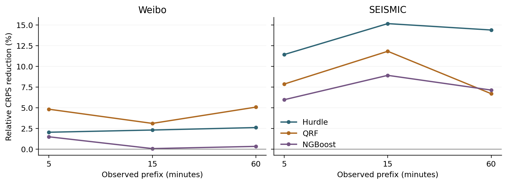
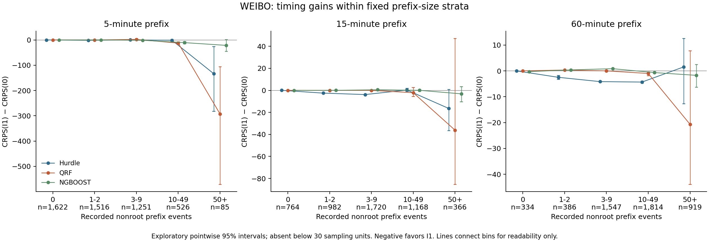
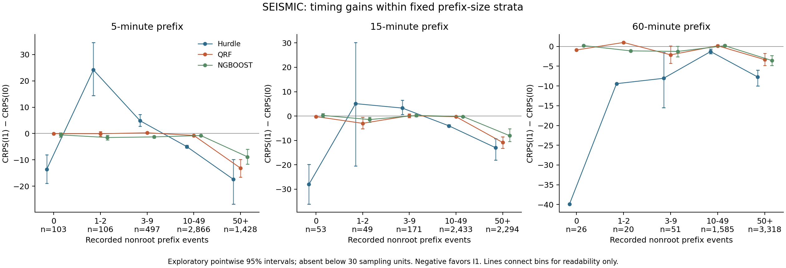
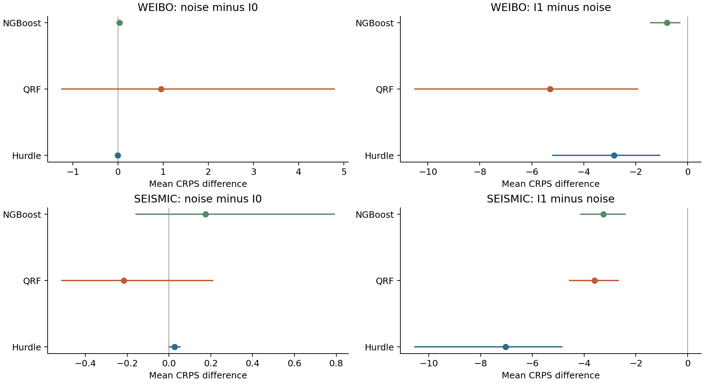

# Technical supplement: the two-source timing-information study

Version: 13 September 2026. Companion to `BRACE_MANUSCRIPT_PHASE14_REVIEWED_EN.md`. Sections S1–S7 preserve the original Phase 13F experiment and review. S8 integrates the completed Phase 14A/14B supplement; S9 records the independent review of its saved outputs.

## S1. Study provenance and frozen decisions

The current experiment is a new, source-specific forecast comparison informed by earlier BRACE development. It uses a root-relative endpoint of 86,400 seconds. Older studies used an additional 24 hours after a prediction prefix. Their numerical results are not pooled with, or renamed as, the current results.

| Record | Purpose | Evidence status |
| --- | --- | --- |
| Legacy development through Phase 12D | Investigate count forecasting, temporal adapters and numerical behavior | Development history; different cohorts and, in relevant earlier studies, a different horizon |
| 13A | Identify and audit the DeepHawkes Weibo release | Ingestion reproduced with documented anomalies; no model evaluation |
| 13B | Freeze cohorts, information sets and root-relative target | 26,000 roots, 78,000 windows; preparation reproduced |
| 13C / 13C-R1 | Bounded TRAIN pilot and numerical compatibility | Initial timeout retained; recovery completed; 17 original NGBoost score failures retained |
| 13D | Score the same saved NGBoost laws under a refined certificate; bounded domain-adapter decision | 1,536 score calculations completed; original failures preserved; CASPER adapter unqualified |
| 13E | Select shared family settings using VALIDATION | 154 jobs, 74 score failures; 40 qualified objects locked |
| 13F | One evaluation of retained objects on TEST | All 600,000 model-window scores complete; six primary comparisons available |
| Original Phase 13F review | Check artifacts and independently aggregate saved results; write manuscript | No model loads, fits, forecasts, row scores or bootstrap draws |
| Phase 14A supplement | Stratify stored losses and compute saved-median MSLE | Mac reaggregation matches the supplied Linux reference; no new real forecasts or CRPS |
| Phase 14B supplement | Dimension-matched noise control | 42 procedures, 48 component fits, 630,000 complete scores and 12 available supplementary contrasts |
| Phase 14 return review | Verify archive, saved rows, aggregates and saved bootstrap quantiles; integrate manuscript | No new fits, predictions, distribution scores or bootstrap draws |

The detailed protocols are retained in `protocols/PROTOCOL_PHASE13B.md`, `PROTOCOL_PHASE13E.md`, `PROTOCOL_PHASE13F.md`, and `PROTOCOL_PHASE14.md`. The Phase 14 freeze receipt is also retained. The records are prospective with respect to their stated performance evaluations, informed by disclosed earlier results and metadata. No external registry acceptance is claimed. The hashes establish the relationship among retained artifacts; their timestamps alone are not an independent public preregistration service.

Weibo roles are assigned by root-user hash into 60/20/20 pools, followed by a separate root ordering to select 6,000/2,000/5,000 roots. SEISMIC uses the declared day blocks and prior-use exclusions. Exact identity strings are preserved, including scientific-notation IDs. Hashes and fixed cohort files, rather than floating-point conversion of identifiers, define membership. All quality exclusions were specified before current model evaluation.

## S2. Exact model and selection specification

All models fit 18,000 rows from the 6,000 TRAIN roots in a source. Each root contributes the same three windows. Poisson, NB2 and Hurdle use TRAIN-fitted scaling; forest and boosting inputs retain the fixed feature transforms. Targets are stored separately from features, and the prediction contract rejects feature records containing a response field.

### S2.1 Grids and fitting

| Family | Ordered candidates, indices 0–3 | Fixed settings |
| --- | --- | --- |
| Hurdle | Count ridge 1, 0.1, 0.01, 0.001 | Logistic activity gate, C=1; shifted positive count 1+NB2 |
| NB2 GLM | Ridge 1, 0.1, 0.01, 0.001 | Penalized joint likelihood, log-link mean, common size |
| Poisson GLM | Ridge 1, 0.1, 0.01, 0.001 | Log-link mean |
| QRF | (depth, minimum leaf) = (8,50), (8,10), (12,50), (12,10) | 128 trees; bootstrap; all predictors available per split; one worker |
| NGBoost | (stages, depth) = (100,1), (300,1), (100,2), (300,2) | Normal LogScore on log1p(Y); leaf minimum 10; learning rate 0.03 |
| Conditional empirical | k=250,100,50,25 | Same-window nearest log-prefix size; lexical root-ID tie-break |
| Empirical by window | One distribution | All TRAIN responses at the corresponding window |

The Hurdle gate uses lbfgs, tolerance 1e−7 and at most 1,000 iterations. NB slopes have an L2 penalty and the intercept is unpenalized. NB coefficients are bounded in [−20,20], and size in [0.001,1e6]. L-BFGS-B limits are 1,000 iterations and 1,500 objective evaluations, with ftol=1e−10 and gtol=1e−6. Poisson uses at most 1,000 iterations and tolerance 1e−7. Constant-law branches handle degenerate counts explicitly. The Hurdle's positive component is shifted; it is not the zero-truncated NB likelihood used in some published hurdle implementations.

For each tree, QRF weights every original TRAIN row that shares the query leaf equally, then averages the tree distributions. Bootstrap training shapes the tree, but leaf support is not restricted to bootstrap multiplicities. Its finite support is retained, including when a held-out response exceeds the largest training outcome.

NGBoost uses natural gradients, full rows and predictors at each stage, internal tolerance 1e−4, and no validation-based early stopping. Stage budget and actual returned stages are recorded. It trains a transformed continuous likelihood, not the discrete likelihood induced by rounding. The CDF in the manuscript is the exact count mapping tested by the scorer.

### S2.2 Seed schedule, eligibility and selection

QRF and NGBoost use seeds 20260913, 20260914 and 20260915. Other procedures use the first seed. A shared candidate is eligible only if every required I0/I1/seed job completes its fit and all validation rows. Select the smallest average validation root CRPS across both information sets and the prescribed seeds. Differences within 1e−8 tie; the lowest candidate index wins. The conditional empirical k is selected by I0 validation CRPS.

| Source | Family | Selected candidate | Setting | Retained objects |
| --- | --- | --- | --- | --- |
| Weibo | Hurdle | 0 | Ridge 1 | 2 |
| Weibo | NB2 GLM | 0 | Ridge 1 | 2 |
| Weibo | Poisson GLM | 3 | Ridge 0.001 | 2 |
| Weibo | QRF | 3 | Depth 12, leaf 10 | 6 |
| Weibo | NGBoost | 0 | 100 stages, depth 1 | 6 |
| Weibo | Conditional empirical | 3 | k=25 | 1 |
| Weibo | Empirical by window | 0 | Fixed | 1 |
| SEISMIC | Hurdle | 3 | Ridge 0.001 | 2 |
| SEISMIC | NB2 GLM | 3 | Ridge 0.001 | 2 |
| SEISMIC | Poisson GLM | 3 | Ridge 0.001 | 2 |
| SEISMIC | QRF | 3 | Depth 12, leaf 10 | 6 |
| SEISMIC | NGBoost | 3 | 300 stages, depth 2 | 6 |
| SEISMIC | Conditional empirical | 1 | k=100 | 1 |
| SEISMIC | Empirical by window | 0 | Fixed | 1 |

The 154 validation jobs comprised 144 learned procedures and ten reference preparations. Total component fits were 160. Of 924,000 validation score attempts, 923,926 completed and 74 failed the frozen numerical contract. All failures were on Weibo: 11 Hurdle, nine NB2 and 54 NGBoost scores. The 21 affected jobs had converged fits but incomplete scoring; all were retained as ineligible. The chosen 40 objects completed validation and were not refitted after selection. Their bindings are in `evidence/MODEL_LOCK.json`.

### S2.3 Missing specialized process comparison

The declared CASPER adaptation did not qualify. Its final feasibility stage had 12 nonempty attempts: 11 reached the 20,000-iteration limit and one reached its time limit; six empty cases needed no optimization. No qualified predictive means or performance scores followed. Earlier development also investigated a capped TiDeH-inspired adapter under a different experiment contract. Neither branch supplies a like-for-like published process baseline for the present table. The missing baseline limits domain-method comparisons, while leaving the narrower within-family information contrast interpretable. It must not be reported as a loss by published CASPER or TiDeH.

## S3. Scores, numerical rules and inference

For discrete CRPS, empirical laws use their finite-support identity. Poisson, NB2 and Hurdle use the inherited direct-body evaluation and an omitted-tail bound, with target 1e−8 and maximum grid 1,048,576. Parameter means above 1e7 trigger ineligibility rather than clipping.

The rounded transformed-Normal law uses the Phase 13D direct-body plus adaptive convex-tail calculation: direct range 4,096–1,048,576; target 1e−8; tail/body switch 0.1; at most 65,536 blocks; far index at most 2^50; and 30 seconds per score. The returned numerical error bound is saved with each row. This analytic tail certificate includes a floating-point guard but is not a directed-rounding proof of every arithmetic operation. Original unsuccessful score attempts remain unsuccessful in their historical phases.

The central 90% interval score is

\[
(u-l)+20(l-y)\mathbf1\{y<l\}+20(y-u)\mathbf1\{y>u\}.
\]

Intervals use the forecast's discrete quantiles. We report width and coverage alongside the score. Absolute error uses the predictive median, not a mean mislabeled as a median. No extra mean-based comparison is imported from the old manuscript.

PIT diagnostics use ten equal bins. For each case, the randomized PIT is constructed between F(y−1) and F(y), with a SHA-256 uniform based on source/root/window and salt `BRACE13E-PIT-v1`, shared across models and seeds. Nonrandomized bin mass integrates the uniform over this interval; a degenerate interval is assigned to the appropriate boundary bin by the frozen code. No-growth reliability uses ten fixed probability bins. `evidence/CALIBRATION.json` contains the aggregate and per-window bin masses, frequencies, and count/sum-forecast/sum-observed triplets for every procedure. Seed averaging does not create extra independent roots.

The test pass has 40 model jobs, each with 15,000 case forecasts, hence 600,000 model-case evaluations. After averaging windows there are 200,000 model/root summaries; averaging prescribed seed losses gives 120,000 procedure/root summaries for 24 procedures. The actual test cohort comprises 10,000 roots and 30,000 root-window cases. No full-sample procedure mean would be reported after a failed row or missing seed; in this pass all selected procedures completed.

Bootstrap details are fixed: NumPy PCG64, seed 20260916, source order Weibo then SEISMIC, lexical group order, batches of 100 and int64 sample indices. There are 10,000 vectors per source and 60,000 saved contrast values in total. Weibo has 3,467 sampled root-user groups; SEISMIC has 5,000 root units. Within each vector the root-weighted mean is the ratio of sampled root-loss sums to sampled root counts. Percentile quantiles use linear interpolation at 0.05/12 and 1−0.05/12. No additional multiplicity family is inferred from the descriptive tables.

The original index-stream SHA-256 values are retained in `evidence/BOOTSTRAP_DESIGN.json`. The original Phase 13F review checked quantiles of saved replicates without regenerating the primary bootstrap. Phase 14A draws a separate exploratory subgroup bootstrap, described in S8. The conditional uncertainty statements exclude training, tuning and source-selection uncertainty and depend on the adequacy of the declared resampling units.

## S4. Full secondary results

The companion tables preserve all complete procedures and windows:

- `tables/ALL_PROCEDURES.md`: CRPS, no-growth Brier, median absolute error, 90% coverage, width and interval score for 24 procedures.
- `tables/INTERVAL_COVERAGE.md`: nominal 50/80/90/95% coverage.
- `tables/PER_WINDOW_PRIMARY_FAMILIES.md`: all 18 descriptive timing contrasts by window.
- `tables/TEST_SAMPLE_PROFILE.md`: post-TEST descriptive response and prefix profile.
- `evidence/PROCEDURE_METRICS.json`: full-precision aggregate and per-window results, including the simple references.
- `evidence/CALIBRATION.json`: both PIT constructions and all no-growth reliability bins.

*Figure S1. Descriptive relative CRPS reduction at each observed prefix. Prefix durations are shown at categorical horizontal positions. No separate confidence intervals or hypothesis tests were added. Because every prediction ends at root plus 24 hours, later prefixes also have shorter remaining forecast horizons; differences across windows cannot be attributed solely to observing more information.*

No-growth rates over the 15,000 unique source-window cases are 251/15,000 (1.6733%) on Weibo and 121/15,000 (0.8067%) on SEISMIC. The three windows within a root are dependent. These rates help interpret the Brier scale and should not be treated as independent-event incidence estimates. Sparse high-probability reliability bins are descriptive and can be unstable.

## S5. Prespecified duplicate sensitivity

Three flagged Weibo test roots are excluded only in the descriptive sensitivity. Models and primary results remain unchanged.

| Family | Kept roots | I0 CRPS | I1 CRPS | Difference |
| --- | --- | --- | --- | --- |
| Hurdle | 4,997 | 109.570281 | 107.050111 | −2.520170 |
| QRF | 4,997 | 90.725382 | 86.988110 | −3.737272 |
| NGBoost | 4,997 | 97.853775 | 97.212399 | −0.641376 |

The contrast directions persist, while average score magnitudes change. The sensitivity cannot reconstruct unique events, isolate the reason a flagged root has large loss, or remove training effects of repeated records. No new significance statements are attached. SEISMIC's `unavailable_without_event_ids` flag remains an unknown status rather than a negative duplicate finding.

## S6. Original Phase 13F evidence review

The supplied Phase 13F archive is 160,964,430 bytes with SHA-256:

`592e185fc9a0ad96265b407af71a3e80e9d66ccbe9da140a3bd32c36bfb51ce0`.

All 496 manifest payload names, sizes and hashes were checked; reading every member verified its ZIP CRC. The 39 frozen source files matched the previously prepared kit; all 40 model-object hashes matched the retained lock, itself identical to the previously reviewed Phase 13E lock. The Mac report records 18 successful synthetic tests, one completed test pass, zero fits and zero selection calls.

The independent reporting calculation read all 600,000 saved score rows, verified case identities and complete window membership, and checked all nine stored metrics through both root-aggregation levels. Model/root and procedure/root values matched exactly. The largest aggregate-metric difference from a different summation order was 7.43512e−11; the largest per-window difference was 2.95586e−12. Primary point values, saved-replicate quantiles and duplicate-sensitivity values matched exactly. These checks are recorded in `evidence/INDEPENDENT_REVIEW.json`.

No fitted object was deserialized in this review. No model was retrained, queried or rescored, and no bootstrap draw was repeated. Consequently, verification of the saved reporting arithmetic must be distinguished from an independent reproduction of training or scoring. Calibration plots were checked visually; their saved bin calculations were not independently reconstructed row by row.

The Mac environment is recorded in `evidence/ENVIRONMENT.json`, including Python 3.12.14, NumPy 2.3.5, SciPy 1.17.0, scikit-learn 1.8.0 and NGBoost 0.5.11. Historical cross-platform refitting discrepancies remain in the legacy record. We do not claim bitwise retraining equivalence on arbitrary operating systems.

## S7. Publication figure and artifact notes

The original Phase 13F figures were redrawn from its saved aggregates. The three Phase 14 PNG/PDF figures are preserved from the verified Mac return; the PNGs were visually checked in this review. PIT panels share a vertical range across sources and include explicit family/window titles. Their values are unchanged. Figure S1 displays already planned per-window results; it introduces no new tests. Both PNG and vector PDF exports are included.

This small review package is not a replacement for the full experimental archives. Reproduction of fitting and evaluation requires the pinned data, model source, environments and Phase 13E/13F and Phase 14 archives. Author review should decide the public deposit layout and verify redistribution terms before claiming open access to those artifacts. The consultant package can be reviewed independently for its reported claims and arithmetic without initiating a new experiment.

## S8. Post-13F supplementary analyses, Phase 14

### Status and analysis chronology

The six primary comparisons and their diagnostics had already been observed. The Phase 14 protocol, count bins and noise schedule were frozen before the new strata were calculated and before any real noise fitting. These are prospectively specified supplementary analyses of an already observed test cohort. The Mac saved-score reaggregation matched the supplied Linux reference within the frozen tolerance. The real-data negative control completed once on Mac. Its results are integrated below without modifying the original six primary comparisons or the historical failures.

The historical Phase 13F protocol's 2% reference is preserved as a descriptive convention, without an operational cost justification or an inferential practical-significance test. The revised main discussion uses the full effect sizes instead of dichotomizing them at that value.

### Prefix strata and uncertainty

Bins are fixed at 0, 1–2, 3–9, 10–49 and ≥50 nonroot events. Analyze each window within each source. Weibo resamples entire root-user clusters, then divides sampled stratum loss sums by sampled eligible-root counts; SEISMIC resamples roots. The same 2,000 vectors per source are reused across all windows, bins and families. Each root retains its windows and original seed losses. Pointwise 95% percentile intervals require at least 30 observed sampling units and at least 99% finite resamples. They do not constitute 90 additional confirmatory tests.

| Source | Prefix, min | 0 | 1–2 | 3–9 | 10–49 | ≥50 |
| --- | ---: | ---: | ---: | ---: | ---: | ---: |
| weibo | 5 | 1,622 | 1,516 | 1,251 | 526 | 85 |
| weibo | 15 | 764 | 982 | 1,720 | 1,168 | 366 |
| weibo | 60 | 334 | 386 | 1,547 | 1,814 | 919 |
| seismic | 5 | 103 | 106 | 497 | 2,866 | 1,428 |
| seismic | 15 | 53 | 49 | 171 | 2,433 | 2,294 |
| seismic | 60 | 26 | 20 | 51 | 1,585 | 3,318 |

Relative CRPS reduction, in percent, is 100×(1−I1/I0); negative values are deteriorations. The following table retains all families and bins. It has no fitted threshold or selection of a preferred curve.

| Source | Family | Prefix, min | 0 | 1–2 | 3–9 | 10–49 | ≥50 |
| --- | --- | ---: | ---: | ---: | ---: | ---: | ---: |
| weibo | hurdle | 5 | -0.01 | 2.70 | -0.18 | 0.38 | 5.79 |
| weibo | hurdle | 15 | -0.03 | 3.97 | 10.08 | -0.28 | 1.75 |
| weibo | hurdle | 60 | 0.02 | 8.12 | 10.10 | 10.92 | -0.39 |
| weibo | qrf | 5 | 0.00 | -0.16 | -2.20 | 4.35 | 16.50 |
| weibo | qrf | 15 | 0.00 | 0.03 | 0.24 | 2.33 | 5.19 |
| weibo | qrf | 60 | -0.01 | -1.46 | 0.02 | 3.95 | 6.53 |
| weibo | ngboost | 5 | 0.37 | 0.21 | 1.40 | 3.12 | 1.07 |
| weibo | ngboost | 15 | 0.09 | -0.00 | -1.93 | -0.01 | 0.39 |
| weibo | ngboost | 60 | 0.37 | -1.70 | -3.31 | 2.44 | 0.49 |
| seismic | hurdle | 5 | 25.52 | -41.63 | -19.16 | 14.12 | 13.38 |
| seismic | hurdle | 15 | 43.17 | -9.56 | -10.26 | 15.06 | 15.78 |
| seismic | hurdle | 60 | 47.17 | 19.36 | 21.57 | 6.13 | 15.51 |
| seismic | qrf | 5 | 0.16 | 0.14 | -1.34 | 2.60 | 11.38 |
| seismic | qrf | 15 | 0.65 | 7.39 | -0.52 | 1.40 | 15.35 |
| seismic | qrf | 60 | 2.03 | -5.17 | 8.80 | -1.21 | 8.03 |
| seismic | ngboost | 5 | 1.40 | 2.87 | 5.47 | 2.71 | 7.86 |
| seismic | ngboost | 15 | -0.77 | 3.61 | -0.89 | 0.96 | 11.82 |
| seismic | ngboost | 60 | -0.51 | 5.42 | 5.39 | -1.30 | 8.68 |

*Figure S2. Saved-score I1−I0 contrasts within Weibo prefix-size strata. Intervals are exploratory pointwise intervals with root-user grouping. Vertical scales differ by window to keep all results visible. Lines connect categorical bins for readability only.*

*Figure S3. Corresponding SEISMIC strata. The 26-root empty and 20-root 1–2-event strata at 60 minutes retain points without intervals. No simultaneous threshold claim is made.*

The full tables contain 360 procedure/stratum metric rows and 90 timing-contrast rows. Partition-weighted means recover all 72 procedure/window aggregates across ten metrics within 2.28×10⁻¹³. All zero-prefix I1 additions equal (1,1,0,0,0,0,0). An empty-prefix improvement therefore concerns the fitted function, not event-time variation inside that subgroup.

### Supplementary MSLE of the saved median forecasts

We compute natural-log MSLE, (log1p(median)−log1p(y))², from saved individual-model medians, average losses over seeds and windows within root, then over roots. The table below gives Weibo values; both sources and all procedures are retained in `tables/MSLE_SAVED_MEDIANS.csv`. These values did not select or refit a procedure. A median is generally optimal for absolute error, not for squared log loss. [Gneiting (2011)](https://arxiv.org/abs/0912.0902).

| Family | Information | 5 min | 15 min | 60 min | Root-average |
| --- | --- | ---: | ---: | ---: | ---: |
| empirical_window | I0 | 1.880557 | 2.063790 | 2.321336 | 2.088561 |
| conditional_empirical | I0 | 1.323165 | 1.393302 | 1.444213 | 1.386894 |
| hurdle | I0 | 1.539661 | 1.799347 | 2.518383 | 1.952464 |
| hurdle | I1 | 1.534333 | 1.734562 | 2.221178 | 1.830024 |
| qrf | I0 | 1.316971 | 1.404395 | 1.428152 | 1.383173 |
| qrf | I1 | 1.246641 | 1.137481 | 1.101965 | 1.162029 |
| ngboost | I0 | 1.598530 | 1.481395 | 1.544876 | 1.541601 |
| ngboost | I1 | 1.528144 | 1.424909 | 1.500589 | 1.484547 |

These values are not directly comparable to published DeepHawkes/CasFlow leaderboards: selected roots, split rules, retained duplicates, target boundaries, information access and log conventions must first be aligned.

### Completed independent-noise control

I0 receives seven independent Uniform(−√3,√3) coordinates. Three fixed noise realizations are crossed with one Hurdle seed or three QRF/NGBoost seeds on each source: 42 procedures, at most 48 component fits and 630,000 model-case TEST evaluations on the existing 30,000 distinct test root-window cases. TRAIN/TEST streams are generated separately; each realization is shared across families and fitting seeds. Hyperparameters, loss definitions and numerical score rules are inherited without validation reselection. The 6,000 TRAIN roots per source match the frozen selected-model provenance byte for byte.

The root loss averages the three windows, original model seeds and three noise realizations. Twelve supplementary contrasts compare noise−I0 and I1−noise. Ten thousand common bootstrap vectors per source retain the original grouping and root weighting; bounds use 0.05/24 and 1−0.05/24, retaining the 12-slot multiplicity family when any comparison is withheld. Missing required rows, seeds or realizations withhold the whole affected noise procedure. Original I0/I1 comparisons are preserved.

Independent noise avoids treating impossible shuffled combinations as valid timing vectors, but it is not a perfect capacity match. Continuous noise and sparse, correlated timing summaries provide different opportunities for splits and shrinkage. In particular, adding noise can sometimes improve a forest's out-of-sample accuracy; the negative control is not expected to fail by definition. [Strobl et al. (2007)](https://doi.org/10.1186/1471-2105-8-25), [Hooker, Mentch and Zhou (2021)](https://doi.org/10.1007/s11222-021-10057-z), [Mentch and Zhou (2022)](https://jmlr.org/papers/v23/20-1264.html).

All 42 scheduled control procedures completed, using 48 component fits. Every one of the 630,000 attempted predictions and scores completed, with no prediction failures, score failures, timeouts or recorded warnings. These evaluations reuse the 10,000 test roots; they are not 630,000 independent observations. The Mac preflight reports 17 successful unit tests and three separate synthetic procedure fits using four component fits, outside the real-data budget. No original model was refitted and no validation reselection occurred.

**All 12 supplementary contrasts, full interpretation.**

| Source | Family | Noise CRPS | Noise − I0 [adjusted interval] | I1 − noise [adjusted interval] |
| --- | --- | ---: | --- | --- |
| Weibo | Hurdle | 124.124 | -0.002 [-0.036, +0.030] | -2.838 [-5.212, -1.050] |
| Weibo | QRF | 101.944 | +0.953 [-1.255, +4.803] | -5.304 [-10.532, -1.905] |
| Weibo | NGBoost | 111.283 | +0.033 [-0.036, +0.080] | -0.799 [-1.457, -0.274] |
| SEISMIC | Hurdle | 52.063 | +0.027 [-0.002, +0.056] | -7.041 [-10.573, -4.833] |
| SEISMIC | QRF | 42.660 | -0.216 [-0.515, +0.212] | -3.602 [-4.594, -2.648] |
| SEISMIC | NGBoost | 42.697 | +0.174 [-0.160, +0.793] | -3.257 [-4.145, -2.392] |

Every noise−I0 interval includes zero; all I1−noise intervals are below zero. No equivalence test or margin was specified, so the first result does not prove a null augmentation effect. The second supports the predictive value of this timing representation relative to this fixed control, conditional on the retained models, realizations and sampling assumptions. The primary six-contrast family and this supplementary 12-contrast family are reported separately, without claiming joint error control over all analyses.

**Separate noise realizations, mean CRPS.** Each cell averages the prescribed fitting seeds and root windows; none was selected for final reporting.

| Source | Family | Realization 0 | Realization 1 | Realization 2 |
| --- | --- | ---: | ---: | ---: |
| Weibo | Hurdle | 124.137157 | 124.111029 | 124.124508 |
| Weibo | QRF | 101.478728 | 101.234407 | 103.118272 |
| Weibo | NGBoost | 111.286162 | 111.249499 | 111.312650 |
| SEISMIC | Hurdle | 52.075040 | 52.067359 | 52.045596 |
| SEISMIC | QRF | 42.652127 | 42.684987 | 42.642352 |
| SEISMIC | NGBoost | 42.670395 | 42.745813 | 42.673987 |

The aggregate control averages the losses over all three realizations. It is not a predictive mixture distribution, and its bootstrap intervals do not integrate over hypothetical new noise realizations. The Weibo QRF realization means illustrate variability that remains outside those conditional intervals.

*Figure S4. Noise−I0 and I1−noise mean CRPS contrasts. All 12 intervals use the separate Bonferroni-adjusted supplementary family and saved paired bootstrap draws. Panels have different horizontal scales; some narrow intervals are compressed by the scale needed for QRF. Exact endpoints are retained in the table and `tables/NOISE_COMPARISONS.csv`.*

The complete records include `tables/NOISE_REALIZATION_SUMMARIES.csv`, `evidence/phase14/STAGE_B_REPORT.json`, `evidence/phase14/PROCEDURE_COMPLETENESS.json`, and both saved bootstrap arrays. The generator, settings and numerical contract were retained after all outcomes were observed.

### Scope decision and preserved history

The main paper evaluates compact summaries within general distributional learners. Specialized event-process comparisons are outside that scope. The prior numerically qualified 12D adapter and the separate unqualified CASPER adapter remain documented in the experimental history; neither establishes failure of the published methods. No new domain-process fitting or seven-feature importance sweep is scheduled in Phase 14.

The revised manuscript cites the final three-author Hooker, Mentch and Zhou (2021) journal article, *Statistics and Computing* 31, Article 82, DOI 10.1007/s11222-021-10057-z. The frozen protocol and its historical citation bytes remain unchanged.

## S9. Independent review of the Phase 14 return

The received archive is `BRACE_PHASE14_RETURN_20260913T192805Z.zip`, 222,470,817 bytes, SHA-256:

`5295b94b6c6bfef77b14bbe94d16ed977e489e05dafe5e0b667d49cd1f7d2784`.

The review checked the inventory, safe unique paths, sizes, SHA-256 and CRC for all 521 payloads. All 108 source-manifest payloads and its manifest match the original supplementary kit byte for byte. Forty-two model files were hashed without deserialization. All 12 noise-matrix files matched their bindings.

An independent script read every one of the 630,000 saved score rows, checking unique root/window membership, source, group, prefix count, response, completion status and the stored CRPS error bound. It reconstructed all six noise-procedure loss arrays from the required seeds and three realizations, compared all 18 realization means and all 12 contrasts, and evaluated the declared quantiles of the saved bootstrap replicates. Regrouping the floating-point summation over realizations produced a maximum difference of 5.821×10⁻¹¹ across the ten-metric loss arrays, within the review tolerance; the maximum difference in reported noise-contrast point quantities was 6.662×10⁻¹⁶. All saved interval endpoints matched exactly.

The review also recovered all 90 stratum CRPS contrasts and their interval decisions from saved procedure arrays. There are 64 negative and 26 positive point estimates; these are direction counts, not counts of statistically established subgroup effects. Six intervals remain withheld for the two sparse SEISMIC strata at 60 minutes across all three families. The primary CRPS means remain consistent with the unchanged Phase 13F record, with a maximum summation-order difference of 1.422×10⁻¹⁴.

No models were fitted or queried, no distribution scores were recomputed, and no bootstrap samples were generated during this review. The saved bootstrap quantiles were checked without regenerating the index streams; the frozen grouping implementation was inspected. This is verification of recorded evidence, not an independent rerun of training or numerical scoring. The Mac source/parent integrity receipts are retained separately from this review. The independent verifier and its bounded scope are in `code/review_saved_phase14.py` and `evidence/phase14/INDEPENDENT_PHASE14_REVIEW.json`.
